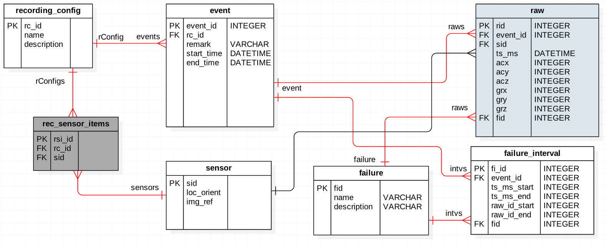

# Introduction 簡介

**問題描述**
C&W的45Gbit/s高頻線纜在cabling製程中，因轉盤轉速、張力等差異，導致在某個時間點絞製出來的線品質不佳

**預期產出**
一個可以不間斷收集機台數據的簡易資料收集系統
1. 不間斷紀錄6~24小時的cable生產時的相關量測數據
2. 具有基本的資料庫系統
3. 做簡單的數據圖表檢視/時間篩選, 觀察與不良品之關聯性

**文檔**
本文檔主要即說明後端伺服器所提供之API，提供前端和Gateway使用


**資料庫Schema**


# Authentication

There's no authentication in this project.

# Raws

## Get a Specific Raw


```shell
# using curl
curl http://path_to_host/api/raw/rid

# using httpie
http get http://path_to_host/api/raw/rid
```

```python
import requests
response = requests.get('http://path_to_host/api/raw/rid')
```

> The above command returns JSON structured like this:

```json
{
  "acx": 100,
  "acy": 100,
  "acz": 102,
  "event_id": 2,
  "grx": 90,
  "gry": 84,
  "grz": 80,
  "rid": 33,
  "sid": 3,
  "ts_ms": "2017-09-27T16:09:27.241892"
}
```

This endpoint retrieves a specific raw record.

### HTTP Request

`GET http://path_to_host/api/raw/rid`

<!-- ### Query Parameters -->

<!-- Parameter | Default | Description -->
<!-- --------- | ------- | ----------- -->
<!-- include_cats | false | If set to true, the result will also include cats. -->
<!-- available | true | If set to false, the result will include kittens that have already been adopted. -->

<!-- <aside class="success"> -->
<!-- Remember — a happy kitten is an authenticated kitten! -->
<!-- </aside> -->

## Get Filtered Raws

```shell
# using curl
curl http://path_to_host/raw \
-H "Content-Type: application/json" \
-d '{"rc_id":1,
     "event_id":2, 
     "start_datetime":"2017-09-27 17:53:27.350000", 
     "end_datetime": "2017-09-27 17:53:27.400000"}'

# using httpie
http post http://path_to_host/raw \
  rc_id:=1 \
  event_id:=2 \
  start_datetime='2017-09-27 17:53:27.350000' \
  end_datetime='2017-09-27 17:59:27.400000'
```

```python
import requests
json_data = {'rc_id':1,
             'event_id':2, 
             'start_datetime': '2017-09-27 17:53:27.350000',
             'end_datetime': '2017-09-27 17:53:27.400000'}
response = requests.post('http://path_to_host/api/raw/rid', json=json_data)
```

> The above command returns JSON structured like this:

```json
[
    {
        "acx": 105,
        "acy": 103,
        "acz": 98,
        "event_id": 2,
        "grx": 95,
        "gry": 101,
        "grz": 92,
        "rid": 181,
        "sid": 1,
        "ts_ms": "2017-09-27T17:53:27.381438+00:00"
    },
    {
        "acx": 61,
        "acy": 49,
        "acz": 48,
        "event_id": 2,
        "grx": 29,
        "gry": 12,
        "grz": 13,
        "rid": 182,
        "sid": 2,
        "ts_ms": "2017-09-27T17:53:27.381438+00:00"
    },
    {
        "acx": -85,
        "acy": -72,
        "acz": -79,
        "event_id": 2,
        "grx": -77,
        "gry": -61,
        "grz": -49,
        "rid": 183,
        "sid": 3,
        "ts_ms": "2017-09-27T17:53:27.381438+00:00"
    }
]
```

This endpoint retrieves raws filtered by {rc_id, event_id, start_datetime, end_datetime}

<!-- <aside class="warning">Inside HTML code blocks like this one, you can't use Markdown, so use <code>&lt;code&gt;</code> blocks to denote code.</aside> -->

### HTTP Request

`POST http://path_to_host/raw`

### JSON Parameters

Parameter | Description
--------- | -----------
rc_id | The primary key of the recording_config to retrieve
event_id | The primary key of the event to retrieve
start_datetime | The start datetime of the raws
end_datetime | The end datetime of the raws

## Delete a Specific Raw

> The above command returns JSON structured like this:

```json
{
  "id": 2,
  "deleted" : ":("
}
```

This endpoint deletes a specific raw.

### HTTP Request

`DELETE http://path_to_host/raw/<rid>`

### URL Parameters

Parameter | Description
--------- | -----------
ID | The ID of the raw to delete


# RecordingConfig

## List All RecordingConfigs


```shell
# using curl
curl http://path_to_host/api/recording_config

# using httpie
http get http://path_to_host/api/recording_config
```

```python
import requests
response = requests.get('http://path_to_host/api/recording_config')
```

> The above command returns JSON structured like this:

```json
{
  "num_results": 2,
  "objects": [
    {
      "description": "test",
      "events": [
        {
          "end_time": null,
          "event_id": 1,
          "rc_id": 1,
          "remark": "sent by simulator",
          "start_time": null
        }
      ],
      "name": "config: 3 sensors",
      "rc_id": 1,
      "sensors": []
    },
    {
      "description": "test",
      "events": [],
      "name": "config: 2 sensors",
      "rc_id": 2,
      "sensors": []
    }
  ],
  "page": 1,
  "total_pages": 1
}
```

This endpoint lists all recording_config records.

### HTTP Request

`GET http://path_to_host/api/recording_config`


## Insert a Recording Config Record

```shell
# using curl
curl http://path_to_host/api/recording_config

# using httpie
http post http://path_to_host/api/recording_config name='rec_name' description='...'
```

```python
import requests
response = requests.post('http://path_to_host/api/recording_config', 
                    json={'name': 'rec_name', 'description': '...')
```

> The above command returns JSON structured like this:

```json
{
  "description": "...",
  "events": [],
  "name": "rec_name",
  "rc_id": rc_id_number,
  "sensors": []
}
```

This endpoint inserts a new recording_config record.

### HTTP Request

`POST http://path_to_host/api/recording_config`

### JSON Parameters

Parameter | Description
--------- | -----------
rc_id | The primary key of the recording_config to insert
name | The name of the recording_config
description | The description of the recording_config
